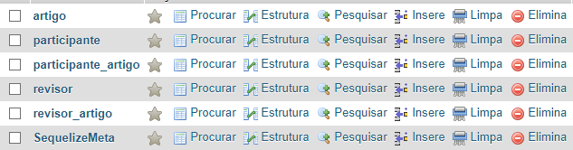
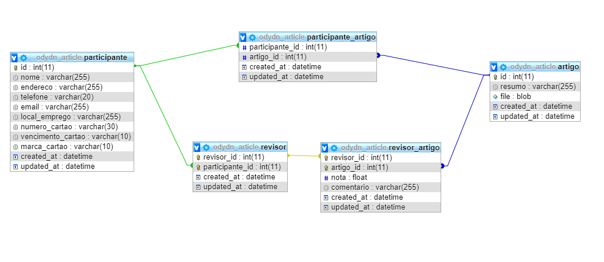

# Article API
API para fazer inscrição de participantes e seleção de artigos.

## Rotas da API

- **GET** /participante - *Pegar todos os participantes*
- **GET** /participante/:id - *Pegar um participante pelo id*
- **POST** /participante - *Criar um participante*
- **POST** /participante/generate_participante_data - *Gerar registros para povoar o banco*

* **GET** /artigo - *Pegar todos os artigos*
* **GET** /artigo/:id - *Pega um artigo pelo id*
* **POST** /artigo - *Criar um artigo*

## Desenvolvimento

- [x] Criação das migrations para criação do banco
- [x] Criação das models para acessar o banco
- [x] Criação serviços de consulta e cadastro
- [x] Criação dos controllers e das rotas
- [x] Rota para povoar o banco
- [ ] Rota de extração de dados para o banco sqlite no Android
- [ ] ETL para o mongodb

## Como foi feito

### Model, Migrations e Modelo Lógico

As models e as migrations foram feitas usando o [CLI do sequelize](https://github.com/sequelize/cli) basta usar o comando **model:generate** e seram criados dois arquivos a model na pastas de models e a migration na pasta das migrations.

#### Exemplo de uso:
```
npx sequelize-cli model:generate --name modelName --attributes atributo1:string,atributo2:integer
```

Para executar as migrations e criar o banco basta rodar o comando db:migrate.

#### Exemplo:
```
npx sequelize-cli db:migrate
```

Depois de rodar o comando todas as tabelas foram criadas.



A tabela SequelizeMeta é uma tabela de controle do sequelize pra ele saber quais migrations já foram 
executadas no banco.

#### Modelo Lógico



### Povoamento
A função de povoamento foi feita usando a biblioteca [**faker**](https://github.com/marak/Faker.js/) que vem com várias funções de geração de dados aleatórios para *nome*, *endereço*, *telefone*, *e-mail* etc. E para gerar o número do cartão de crédito foi usada a biblioteca [**creditcard-generator**](https://github.com/VRMink/credit-card-generator).

Para a geração dos artigos foi usado a biblioteca faker para gerar o texto e a biblioteca [**pdfmake**](http://pdfmake.org) para gerar o pdf em binário. Cada artigo contém um título e dois parágrafos gerados pelo faker e depois é criado o pdf usando a função **createPdfKitDocument** como podemos ver nos pedaços de código a seguir:

```
...
const title = faker.lorem.sentence();
const body = faker.lorem.paragraphs(2);
...
```
```
...
const printer = new pdfmaker(fonts);
const doc = printer.createPdfKitDocument(pdfDoc);
...
```

Depois de inserir o participante e o artigo no banco de dados precisamos inserir as notas do artigo então pegamos do banco, se possível, cinco revisores e são geradas cinco notas aleatórias e um comentário.

### Extração de dados

Para a função de extração de dados para o sqlite temos que criar fazer uma paginação, pois não muitos registros para exportar. Então pegamos os primeiros ***n*** registros das tabelas começando de ***k*** até exportar todos os registros da tabela. O aplicativo **Android** terá que começar a importação pelas tabelas que não possuem chaves estranheiras para não da erro de *foreign key* inexistente. Depois disso basta importar as tabelas que possuem *foreign key*. No final teremos cinco rotas para exportar os dados de cada uma das tabelas.

## Desafios

- Encontrar um banco remoto gratuito com espaço de 1GB